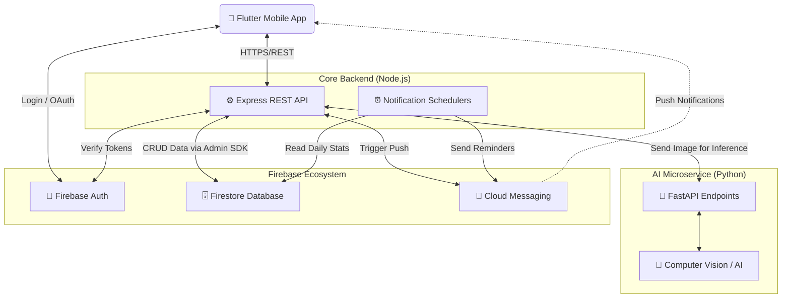

# 🩺 Health Tracker App

A full-stack Health Tracker application that helps users record daily health metrics and build sustainable habits. The project combines a **Flutter** mobile client, a **Node.js** backend, an **AI microservice** (FastAPI), and **Firebase** for authentication and data storage. It is designed to be production-ready with Docker, CI/CD, and Kubernetes deployment configurations.

## ✨ Highlights

- 🧭 **User-centric tracking**: Calories, water, meals, and other daily health metrics.
- 🧠 **AI-assisted food analysis**: Automatic nutrition calculation via custom image recognition models.
- ⏰ **Smart notifications**: Automated reminders for meals, hydration, workouts, and daily summaries.
- 🔐 **Secure Auth**: Authentication via Google, Facebook, and Firebase Auth.
- 📱 **Mobile-first UX**: Smooth, intuitive interface built with Flutter.
- 🚀 **DevOps Ready**: CI/CD pipelines (GitLab), Docker, and Kubernetes manifests (EKS-compatible).

---

## 🏛️ System Architecture

The application is built on a modern microservices architecture separating the client, backend logic, and heavy AI inference tasks.



---

## 🧰 Tech Stack

- **Frontend:** Flutter & Dart
- **Backend:** Node.js, Express.js
- **Database & Auth:** Firebase Firestore, Firebase Authentication, FCM
- **AI Service:** Python 3.11, FastAPI, Uvicorn, Custom ML Models
- **DevOps:** Docker, GitLab CI/CD, SonarQube, Semgrep, Kubernetes, ArgoCD

---

## ⚡ Quickstart (Local Development)

### 1. Firebase Emulator
Start the local Firebase emulator (Auth + Firestore):
```bash
firebase emulators:start --only auth,firestore
```

### 2. Backend (Node.js)
Copy the environment template and start the backend:
```bash
cd backend
cp .env.example .env
npm install
npm run dev
```
> The backend defaults to `http://localhost:5001`.

### 3. AI Service (FastAPI)
Create a Python 3.11 virtual environment and start the AI engine:
```bash
cd AI
python3.11 -m venv .venv
source .venv/bin/activate
pip install -r requirements.txt
python -m uvicorn main:app --host 0.0.0.0 --port 8000 --reload
```
> The AI service is available at `http://localhost:8000`.

### 4. Flutter App
Run the app and point it to the local backend API:
```bash
cd frontend
flutter run -d <DEVICE_ID> --dart-define=BASE_API_URL=http://127.0.0.1:5001
```

---

## 🛡️ Security & Authentication

- **Firebase Admin SDK:** Generate a private key from Firebase Console and save it to `backend/secrets/firebase-adminsdk.json`.
- Do **not** commit `.env` or the `secrets/` directory to source control.
- Ensure production secrets are managed securely via CI/CD variables or Kubernetes Secrets.

---

## 🚢 CI/CD & Deployments

This project contains pipeline definitions (`.gitlab-ci.yml`) and Kubernetes manifests for automated deployment:
- **Testing & Quality:** Semgrep (SAST), SonarQube, Zap (DAST).
- **Build & Package:** Automated Docker image builds for Backend and AI services pushed to Harbor Registry.
- **GitOps Deployment:** Kustomize manifest updates and automatic synchronization via ArgoCD.

---

## 🎨 Design & Screenshots

Below are selected screens illustrating the mobile UX.

| 01 - Hero | 02 - Dashboard | 03 - Meal Logging |
| :---: | :---: | :---: |
| [](./image/Simulator%20Screenshot%20-%20iPhone%2017%20Pro%20-%202025-12-23%20at%2020.05.22.png) | [](./image/Simulator%20Screenshot%20-%20iPhone%2017%20Pro%20-%202025-12-23%20at%2020.05.30.png) | [](./image/Simulator%20Screenshot%20-%20iPhone%2017%20Pro%20-%202025-12-23%20at%2020.05.45.png) |

| 04 - Reminders | 05 - Analytics | 06 - Profile |
| :---: | :---: | :---: |
| [](./image/Simulator%20Screenshot%20-%20iPhone%2017%20Pro%20-%202025-12-23%20at%2020.06.10.png) | [](./image/Simulator%20Screenshot%20-%20iPhone%2017%20Pro%20-%202025-12-23%20at%2020.06.48.png) | [](./image/Simulator%20Screenshot%20-%20iPhone%2017%20Pro%20-%202025-12-23%20at%2020.07.00.png) |

> *Note: More screenshots and sample AI food recognition inputs are available in the `image/` directory.*

---

## 🗺️ Roadmap

- [ ] Health analytics dashboard & deep insights.
- [ ] AI-powered advanced meal recommendations.
- [ ] Enhanced push notification flows with personalized routines.
- [ ] Advanced monitoring & observability (Prometheus, Grafana integration).

---

## 👤 Authors

- **Mai Nguyễn Bình Tân** — Software Engineering, AI & DevOps
- **Nguyễn Đăng Khoa** — UI/UX Design
